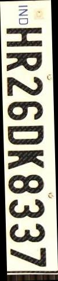
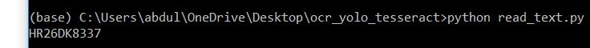

# ocr_yolo_tesseract
OCR is a technology that recognizes text within a digital image. It is commonly used to recognize text in scanned documents, but it serves many other purposes as well.  OCR software processes a digital image by locating and recognizing characters, such as letters, numbers, and symbols. 

**I acquired the data for this task from here - https://dataturks.com/projects/devika.mishra/Indian_Number_plates -**

**Images in this dataset looks like -** 

Steps - 
Instructions - Please make changes to the code input locations wherever required, for images mainly.   

1. Use Trained Model to generate text region with the help of the file generate_text_region.py from terminal you have to make changes to the location of input image. after doing this change run this code in your terminal - 
python generate_text_region.py

Output would look like - In you python file's directory look for licence0000.jpg

2. Now Use this image to input in the check skew using this command in the terminal - 

deskew input.png

if skew is present use 
deskew --output output.png input.png

after deskewing image would look like - 

3. Use below command to generate text as output from finale deskewed image - 

python read_text.py

output would look like this - 

You can convert this to text file as well using >'name.txt' in above python statement
